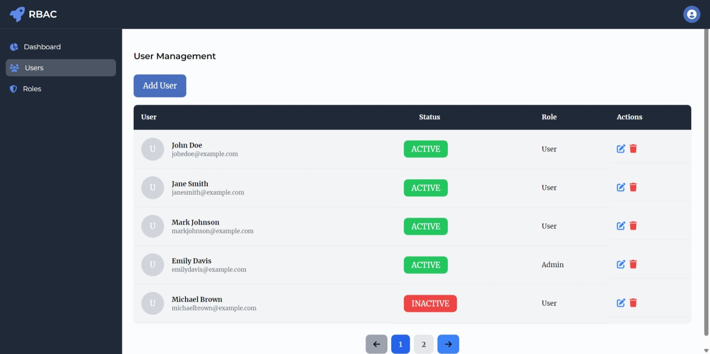
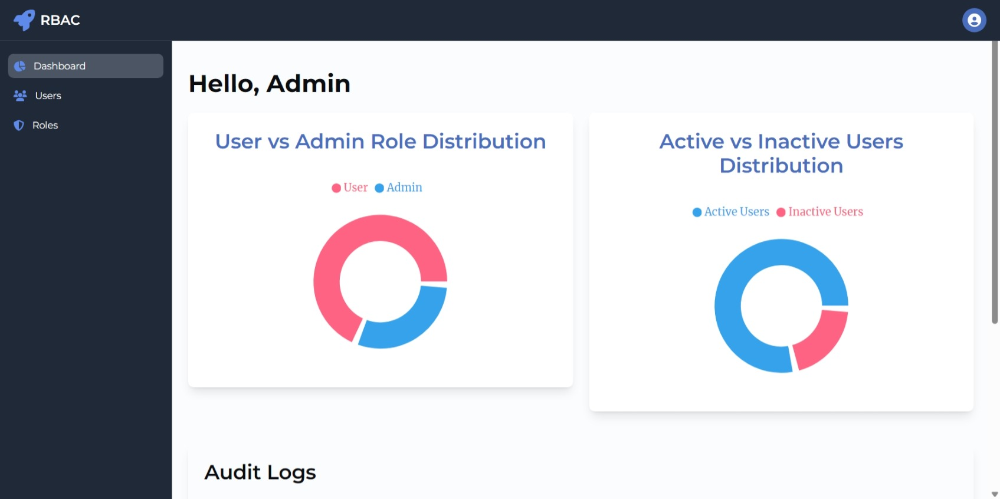

# Admin Dashboard Project

This project is an **Admin Dashboard** built with **React** and **Recharts**. The project connects to a backend server (`json-server`) for user data.

---

## **Technologies Used**
- **React**: Component-based UI development.
- **Recharts**: Interactive chart visualizations.
- **json-server**: Mock REST API for backend data.

---

## Screenshots




## **Getting Started**

### **Prerequisites**
- Node.js installed on your system.
- A package manager like npm or Yarn.

### **Installation**
1. Clone the repository:
   ```bash
   git clone https://github.com/your-username/admin-dashboard.git
   ```
2. Navigate to the project directory:
   ```bash
   cd admin-dashboard
   ```
3. Install dependencies:
   ```bash
   npm install
   ```

### **Run the Application**
1. Start the mock server with `json-server`:
   ```bash
   npx json-server --watch db.json --port 3001
   ```
2. Start the React application:
   ```bash
   npm start
   ```
3. Open your browser and navigate to:
   ```
   http://localhost:3000
   ```

---

## **API Endpoints**

### Endpoints Used:

- `GET /users`: Fetch all users.
- `POST /users`: Add a new user.
- `PUT /users/:id`: Edit a user by ID.
- `DELETE /users/:id`: Delete a user by ID.

- `GET /roles`: Fetch all roles.
- `POST /roles`: Add a new role.
- `PUT /roles/:id`: Edit a role by ID.
- `DELETE /roles/:id`: Delete a role by ID.
